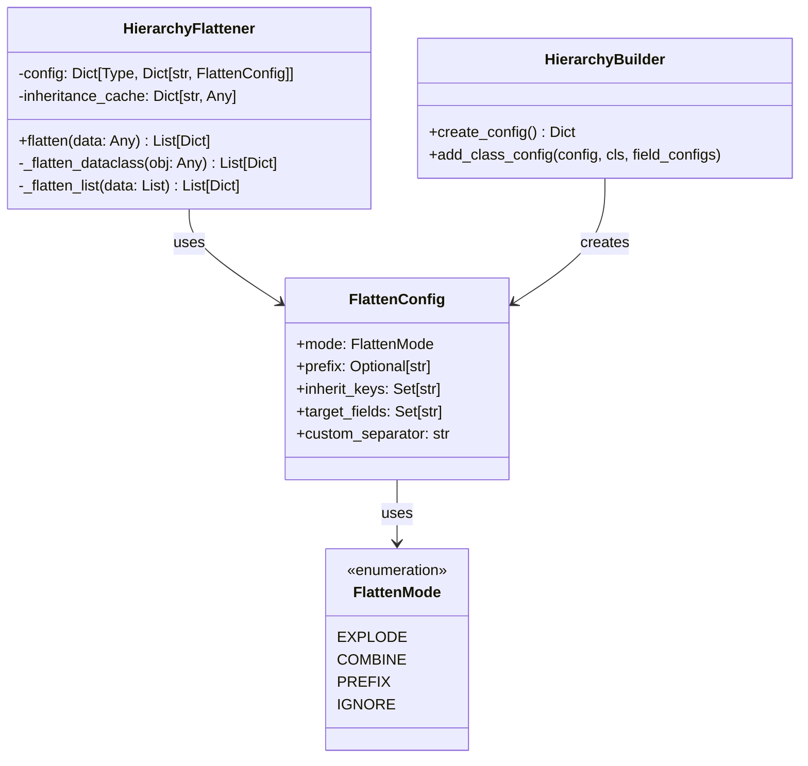
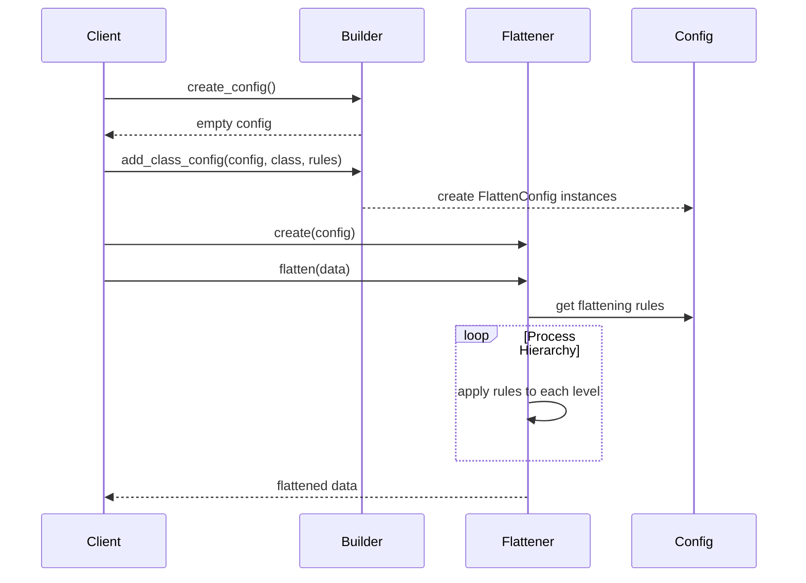
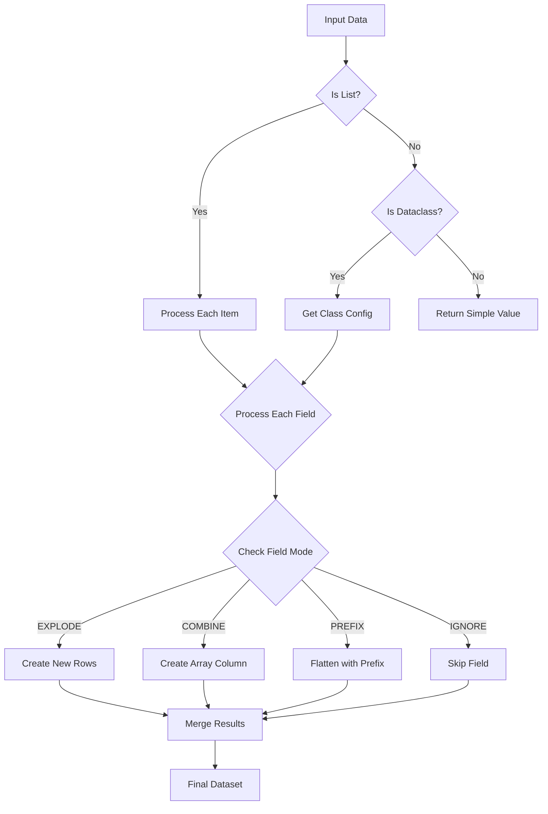

# Hierarchy Flattener Framework

## Overview
The Hierarchy Flattener Framework provides a flexible and configurable way to transform deeply nested data structures into flat, tabular formats while preserving relationships and context. It's particularly useful for converting complex object hierarchies into formats suitable for data analysis and storage.

## Requirements

### Functional Requirements

1. Data Structure Support
   - Handle nested dataclass hierarchies of arbitrary depth
   - Support lists of dataclasses as attributes
   - Process optional fields and nullable values
   - Maintain parent-child relationships

2. Flattening Capabilities
   - Convert nested structures to tabular format
   - Preserve hierarchical relationships
   - Support multiple flattening strategies per field
   - Allow inheritance of parent attributes
   - Configure column naming and prefixing

3. Configuration
   - Define flattening rules per class and field
   - Support multiple output formats
   - Allow customization of key inheritance
   - Enable field filtering and selection

### Non-Functional Requirements

1. Performance
   - Efficient processing of large hierarchies
   - Minimal memory overhead
   - Support for lazy evaluation where possible

2. Usability
   - Clear configuration interface
   - Type-safe operation
   - Informative error messages
   - Easy integration with existing code

3. Maintainability
   - Clear separation of concerns
   - Extensible design
   - Well-documented interfaces
   - Testable components

## Architecture

### Design Patterns



### Component Interactions



## Implementation

### Core Components

1. Flattening Modes
```python
class FlattenMode(Enum):
    """Strategy for flattening nested structures."""
    EXPLODE = auto()      # Create separate rows for nested items
    COMBINE = auto()      # Combine nested items into array columns
    PREFIX = auto()       # Flatten with prefixed column names
    IGNORE = auto()       # Skip this field in flattening
```

2. Configuration Structure
```python
@dataclass
class FlattenConfig:
    """Configuration for field flattening behavior."""
    mode: FlattenMode
    prefix: Optional[str] = None
    inherit_keys: Set[str] = None
    target_fields: Optional[Set[str]] = None
    custom_separator: str = "."
```

### Configuration Example

```python
# Define hierarchy
@dataclass
class Address:
    street: str
    city: str

@dataclass
class Employee:
    id: str
    name: str
    addresses: List[Address]

# Configure flattening
config = HierarchyBuilder.create_config()
HierarchyBuilder.add_class_config(
    config,
    Employee,
    {
        "addresses": FlattenConfig(
            mode=FlattenMode.EXPLODE,
            inherit_keys={"id", "name"}
        )
    }
)
```

### Flattening Process



## Usage Examples

### Basic Usage

```python
# Create flattener
flattener = HierarchyFlattener(config)

# Flatten data
flattened_data = flattener.flatten(employee_data)

# Convert to DataFrame
df = pl.DataFrame(flattened_data)
```

### Configuration Examples

1. Exploding Nested Lists
```python
config = {
    Employee: {
        "addresses": FlattenConfig(
            mode=FlattenMode.EXPLODE,
            inherit_keys={"id", "name"}
        )
    }
}
```

2. Combining Array Values
```python
config = {
    Employee: {
        "skills": FlattenConfig(
            mode=FlattenMode.COMBINE
        )
    }
}
```

3. Prefixing Nested Fields
```python
config = {
    Employee: {
        "primary_address": FlattenConfig(
            mode=FlattenMode.PREFIX,
            prefix="primary"
        )
    }
}
```

## Output Formats

### Exploded Format
```text
id    name    address_street    address_city
1     John    123 Main St      New York
1     John    456 Side St      Boston
```

### Combined Format
```text
id    name    address_streets              address_cities
1     John    ["123 Main St", "456 Side St"]    ["New York", "Boston"]
```

### Prefixed Format
```text
id    name    primary_address_street    primary_address_city
1     John    123 Main St              New York
```

## Best Practices

1. Configuration Design
   - Define clear flattening strategies per field
   - Use consistent naming conventions
   - Document inheritance relationships

2. Performance Optimization
   - Use appropriate flattening modes for data volume
   - Consider memory impact of explosion vs combination
   - Cache frequently accessed configurations

3. Error Handling
   - Validate configurations before processing
   - Provide clear error messages
   - Handle missing or null values appropriately

## Extensions and Customization

1. Custom Transformers
```python
@dataclass
class CustomFlattenConfig(FlattenConfig):
    transform_func: Optional[Callable] = None
```

2. Validation Rules
```python
@dataclass
class ValidatedFlattenConfig(FlattenConfig):
    validators: List[Callable] = field(default_factory=list)
```

3. Output Formatters
```python
class OutputFormatter:
    def format(self, data: List[Dict]) -> Any:
        pass
```

Would you like me to:
1. Add more detailed examples?
2. Expand on any specific section?
3. Add additional design patterns or diagrams?
4. Include performance considerations and benchmarks?


from dataclasses import dataclass, fields, Field, MISSING
from typing import Any, Dict, List, Optional, Set, Type, TypeVar, Union, get_type_hints
from enum import Enum, auto
import polars as pl

class FlattenMode(Enum):
    """Strategy for flattening nested structures."""
    EXPLODE = auto()      # Create separate rows for each nested item
    COMBINE = auto()      # Combine nested items into array columns
    PREFIX = auto()       # Flatten with prefixed column names
    IGNORE = auto()       # Skip this field in flattening

@dataclass
class FlattenConfig:
    """Configuration for how to flatten a specific field."""
    mode: FlattenMode
    prefix: Optional[str] = None  # Prefix for flattened columns
    inherit_keys: Set[str] = None  # Keys to inherit from parent
    target_fields: Optional[Set[str]] = None  # Specific fields to include
    custom_separator: str = "."  # Separator for nested field names

class HierarchyFlattener:
    """Handles flattening of complex nested dataclass hierarchies."""
    
    def __init__(self, config: Dict[Type, Dict[str, FlattenConfig]] = None):
        """
        Initialize with flattening configuration.
        
        Args:
            config: Mapping of dataclass types to field-specific configs
        """
        self.config = config or {}
        self._inheritance_cache: Dict[str, Any] = {}

    def flatten(self, 
                data: Any, 
                parent_data: Optional[Dict[str, Any]] = None,
                current_path: str = "") -> List[Dict[str, Any]]:
        """
        Flatten a nested dataclass hierarchy into a list of dictionaries.
        
        Args:
            data: The dataclass instance or list to flatten
            parent_data: Data inherited from parent objects
            current_path: Current path in the hierarchy
            
        Returns:
            List of flattened dictionaries
        """
        if isinstance(data, list):
            return self._flatten_list(data, parent_data, current_path)
        
        if not is_dataclass(data):
            return [{"value": data}]

        return self._flatten_dataclass(data, parent_data, current_path)

    def _flatten_dataclass(self, 
                          obj: Any, 
                          parent_data: Optional[Dict[str, Any]], 
                          current_path: str) -> List[Dict[str, Any]]:
        """Flatten a single dataclass instance."""
        result_base = {}
        results: List[Dict[str, Any]] = []
        explosions: List[Dict[str, Any]] = []

        # Add inherited data
        if parent_data:
            result_base.update(parent_data)

        obj_type = type(obj)
        field_configs = self.config.get(obj_type, {})

        for field in fields(obj):
            value = getattr(obj, field.name)
            field_path = f"{current_path}.{field.name}" if current_path else field.name
            
            # Get field-specific config or use defaults
            field_config = field_configs.get(field.name, FlattenConfig(
                mode=FlattenMode.PREFIX,
                inherit_keys=set()
            ))

            if field_config.mode == FlattenMode.IGNORE:
                continue

            if field_config.mode == FlattenMode.EXPLODE and isinstance(value, list):
                # Handle list explosion
                for item in value:
                    flattened_items = self.flatten(
                        item, 
                        result_base.copy(), 
                        field_path
                    )
                    explosions.extend(flattened_items)
            
            elif field_config.mode == FlattenMode.COMBINE and isinstance(value, list):
                # Combine list items into array columns
                if value and is_dataclass(value[0]):
                    combined_values = {}
                    for subfield in fields(value[0]):
                        values = [getattr(item, subfield.name) for item in value]
                        combined_values[f"{field.name}_{subfield.name}"] = values
                    result_base.update(combined_values)
                else:
                    result_base[field.name] = value

            elif field_config.mode == FlattenMode.PREFIX:
                # Flatten with prefix
                if is_dataclass(value):
                    prefix = field_config.prefix or field.name
                    flattened = self.flatten(value, None, prefix)[0]
                    result_base.update(flattened)
                else:
                    result_base[field.name] = value

        if explosions:
            # Handle exploded results
            for explosion in explosions:
                combined = result_base.copy()
                combined.update(explosion)
                results.append(combined)
            return results
        else:
            return [result_base]

    def _flatten_list(self, 
                     data: List[Any], 
                     parent_data: Optional[Dict[str, Any]], 
                     current_path: str) -> List[Dict[str, Any]]:
        """Flatten a list of items."""
        results = []
        for item in data:
            results.extend(self.flatten(item, parent_data, current_path))
        return results

class HierarchyBuilder:
    """Helper for building flattening configurations."""
    
    @staticmethod
    def create_config() -> Dict[Type, Dict[str, FlattenConfig]]:
        return {}
    
    @staticmethod
    def add_class_config(config: Dict[Type, Dict[str, FlattenConfig]], 
                        cls: Type, 
                        field_configs: Dict[str, FlattenConfig]) -> None:
        """Add configuration for a specific class."""
        config[cls] = field_configs


#### Example Usage:

from dataclasses import dataclass
from typing import List, Optional

# Example complex hierarchy
@dataclass
class Address:
    street: str
    city: str
    country: str

@dataclass
class Contact:
    email: str
    phone: Optional[str] = None

@dataclass
class Employee:
    id: str
    name: str
    department: str
    address: Address
    contacts: List[Contact]
    skills: List[str]

@dataclass
class Department:
    name: str
    code: str
    manager: Employee
    employees: List[Employee]

@dataclass
class Organization:
    name: str
    headquarters: Address
    departments: List[Department]

# Example usage
def process_organization_data():
    # Create sample data
    org = Organization(
        name="Acme Corp",
        headquarters=Address("123 Main St", "New York", "USA"),
        departments=[
            Department(
                name="Engineering",
                code="ENG",
                manager=Employee(
                    id="E001",
                    name="John Doe",
                    department="ENG",
                    address=Address("456 Tech St", "SF", "USA"),
                    contacts=[
                        Contact("john@acme.com", "555-0001"),
                        Contact("john.doe@personal.com")
                    ],
                    skills=["Python", "Architecture"]
                ),
                employees=[
                    Employee(
                        id="E002",
                        name="Jane Smith",
                        department="ENG",
                        address=Address("789 Code Lane", "SF", "USA"),
                        contacts=[Contact("jane@acme.com")],
                        skills=["Java", "Python"]
                    )
                ]
            )
        ]
    )

    # Create flattening configuration
    config = HierarchyBuilder.create_config()
    
    # Configure Organization flattening
    HierarchyBuilder.add_class_config(config, Organization, {
        "departments": FlattenConfig(
            mode=FlattenMode.EXPLODE,
            inherit_keys={"name"}  # Inherit organization name
        ),
        "headquarters": FlattenConfig(
            mode=FlattenMode.PREFIX,
            prefix="hq"
        )
    })
    
    # Configure Department flattening
    HierarchyBuilder.add_class_config(config, Department, {
        "employees": FlattenConfig(
            mode=FlattenMode.EXPLODE,
            inherit_keys={"name", "code"}  # Inherit department info
        ),
        "manager": FlattenConfig(
            mode=FlattenMode.PREFIX,
            prefix="manager"
        )
    })
    
    # Configure Employee flattening
    HierarchyBuilder.add_class_config(config, Employee, {
        "contacts": FlattenConfig(
            mode=FlattenMode.COMBINE  # Combine multiple contacts
        ),
        "skills": FlattenConfig(
            mode=FlattenMode.COMBINE  # Keep skills as array
        ),
        "address": FlattenConfig(
            mode=FlattenMode.PREFIX
        )
    })

    # Create flattener and process data
    flattener = HierarchyFlattener(config)
    flattened_data = flattener.flatten(org)
    
    # Convert to Polars DataFrame
    return pl.DataFrame(flattened_data)

# Example result processing
def analyze_organization_structure():
    df = process_organization_data()
    
    # Now we can easily analyze the organizational structure
    departments = (df
        .groupby("department")
        .agg([
            pl.col("name").count().alias("employee_count"),
            pl.col("skills").arr.lengths().mean().alias("avg_skills_per_employee")
        ]))
    
    return departments