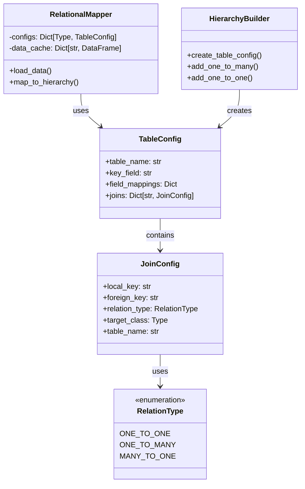
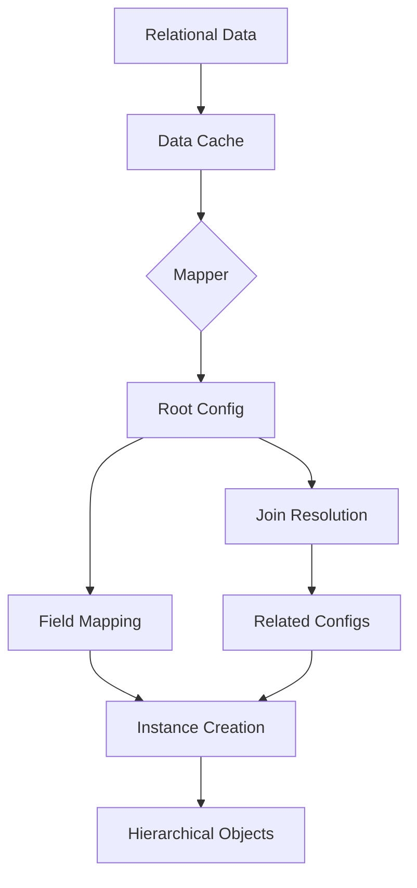
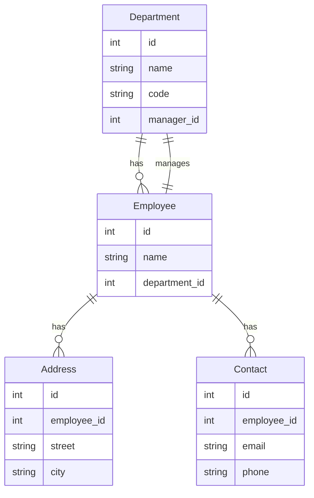

# Relational to Hierarchy Mapping Framework

## Overview
The Relational to Hierarchy Mapping Framework provides a configurable system for transforming relational data into typed, hierarchical dataclass structures. It supports complex relationships, flexible mapping configurations, and efficient data loading patterns.

## Requirements

### Core Requirements

#### 1. Data Structure Support
- **REQ-1.1:** Support mapping to nested dataclass hierarchies
- **REQ-1.2:** Handle one-to-one relationships
- **REQ-1.3:** Handle one-to-many relationships
- **REQ-1.4:** Support optional/nullable relationships
- **REQ-1.5:** Maintain referential integrity

#### 2. Mapping Configuration
- **REQ-2.1:** Define field-level mapping rules
- **REQ-2.2:** Configure table relationships
- **REQ-2.3:** Support different column naming conventions
- **REQ-2.4:** Allow customization of join conditions
- **REQ-2.5:** Support multiple root entry points

#### 3. Data Loading
- **REQ-3.1:** Support batch data loading
- **REQ-3.2:** Handle incremental updates
- **REQ-3.3:** Support filtering at load time
- **REQ-3.4:** Manage memory efficiently
- **REQ-3.5:** Cache frequently accessed data

#### 4. Query Capabilities
- **REQ-4.1:** Filter root records
- **REQ-4.2:** Support eager loading
- **REQ-4.3:** Enable lazy loading of relationships
- **REQ-4.4:** Allow custom join conditions
- **REQ-4.5:** Support complex filtering

### Non-Functional Requirements

#### 1. Performance
- **NFR-1.1:** Efficient memory usage
- **NFR-1.2:** Scalable to large datasets
- **NFR-1.3:** Minimal data copying
- **NFR-1.4:** Efficient relationship traversal
- **NFR-1.5:** Support for batch processing

#### 2. Usability
- **NFR-2.1:** Clear configuration interface
- **NFR-2.2:** Type-safe operations
- **NFR-2.3:** Intuitive API design
- **NFR-2.4:** Comprehensive error messages
- **NFR-2.5:** Well-documented examples

#### 3. Maintainability
- **NFR-3.1:** Modular design
- **NFR-3.2:** Extensible architecture
- **NFR-3.3:** Clear separation of concerns
- **NFR-3.4:** Comprehensive testing
- **NFR-3.5:** Proper error handling

## Architecture

### Component Structure



### Data Flow



## Implementation

### Configuration Examples

1. Basic Table Configuration
```python
config = HierarchyBuilder.create_table_config(
    table_name="employees",
    key_field="id",
    field_mappings={
        "id": "employee_id",
        "name": "full_name",
        "email": "email_address"
    }
)
```

2. Relationship Configuration
```python
# One-to-Many Relationship
HierarchyBuilder.add_one_to_many(
    config=employee_config,
    field_name="addresses",
    target_class=Address,
    target_table="employee_addresses",
    local_key="id",
    foreign_key="employee_id"
)

# One-to-One Relationship
HierarchyBuilder.add_one_to_one(
    config=employee_config,
    field_name="primary_address",
    target_class=Address,
    target_table="employee_addresses",
    local_key="id",
    foreign_key="employee_id"
)
```

### Data Model Pattern



## Usage Patterns

### 1. Basic Mapping

```python
# Create mapper
mapper = RelationalMapper(configs)

# Load data
mapper.load_data("employees", employees_df)
mapper.load_data("addresses", addresses_df)

# Map hierarchy
result = mapper.map_to_hierarchy(Employee)
```

### 2. Filtered Mapping

```python
# Map with filter
active_employees = mapper.map_to_hierarchy(
    Employee,
    filter_expr=pl.col("status") == "active"
)
```

### 3. Relationship Traversal

```python
# Access nested data
for employee in result:
    # One-to-one relationship
    print(employee.primary_address.city)
    
    # One-to-many relationship
    for address in employee.addresses:
        print(address.street)
```

## Best Practices

### 1. Configuration Management
- Group related configurations
- Use consistent naming patterns
- Document relationships clearly
- Validate configurations early

```python
class ConfigurationManager:
    @staticmethod
    def validate_config(config: TableConfig) -> None:
        # Validate field mappings
        # Check relationship consistency
        # Verify table existence
        pass
```

### 2. Performance Optimization
- Use appropriate relationship types
- Configure batch sizes
- Implement caching strategy
- Monitor memory usage

```python
@dataclass
class LoadConfig:
    batch_size: int = 1000
    cache_strategy: CacheStrategy = CacheStrategy.LAZY
    prefetch_relations: List[str] = field(default_factory=list)
```

### 3. Error Handling
- Validate input data
- Handle missing relationships
- Provide clear error messages
- Implement recovery strategies

## Extensions

### 1. Caching Strategies
```python
class CacheManager:
    def __init__(self, strategy: CacheStrategy):
        self.strategy = strategy
        self._cache = {}

    def get_or_load(self, key: str, loader: Callable) -> Any:
        if self.strategy == CacheStrategy.EAGER:
            return self._cache.setdefault(key, loader())
        return loader()
```

### 2. Custom Transformations
```python
@dataclass
class FieldTransform:
    field: str
    transform: Callable
    
class TransformingMapper(RelationalMapper):
    def __init__(self, configs, transforms: List[FieldTransform]):
        super().__init__(configs)
        self.transforms = transforms
        
    def _apply_transforms(self, data: Dict) -> Dict:
        for transform in self.transforms:
            if transform.field in data:
                data[transform.field] = transform.transform(
                    data[transform.field]
                )
        return data
```

### 3. Validation Rules
```python
@dataclass
class ValidationRule:
    field: str
    validator: Callable
    error_message: str

class ValidatingMapper(RelationalMapper):
    def __init__(self, configs, rules: List[ValidationRule]):
        super().__init__(configs)
        self.rules = rules
        
    def _validate_data(self, data: Dict) -> None:
        for rule in self.rules:
            if not rule.validator(data.get(rule.field)):
                raise ValueError(f"{rule.field}: {rule.error_message}")
```

## Testing Strategy

### 1. Unit Tests
- Test individual components
- Verify mapping logic
- Validate configurations
- Check error handling

### 2. Integration Tests
- Test complete mappings
- Verify relationship handling
- Check data consistency
- Test performance characteristics

### 3. Performance Tests
- Measure mapping speed
- Monitor memory usage
- Test with large datasets
- Verify caching effectiveness

## Performance Considerations

### 1. Memory Management
- Implement data streaming
- Use efficient data structures
- Manage cache size
- Clear unused references

### 2. Query Optimization
- Minimize database queries
- Use efficient join strategies
- Implement batch loading
- Optimize filter conditions

### 3. Caching Strategy
- Cache frequently accessed data
- Implement cache invalidation
- Use memory-efficient caching
- Monitor cache hit rates

Would you like me to:
1. Add more implementation details?
2. Expand on any specific section?
3. Add more examples or use cases?
4. Include additional design patterns or diagrams?


### Frameowrk Code
from dataclasses import dataclass, fields, is_dataclass
from enum import Enum, auto
from typing import Any, Dict, List, Optional, Set, Type, TypeVar, Generic, Union
import polars as pl

class RelationType(Enum):
    """Types of relationships between entities."""
    ONE_TO_ONE = auto()
    ONE_TO_MANY = auto()
    MANY_TO_ONE = auto()

@dataclass
class JoinConfig:
    """Configuration for joining related tables."""
    local_key: str
    foreign_key: str
    relation_type: RelationType
    target_class: Type
    table_name: str

@dataclass
class TableConfig:
    """Configuration for mapping a table to a dataclass."""
    table_name: str
    key_field: str
    field_mappings: Dict[str, str]  # dataclass_field -> table_column
    joins: Dict[str, JoinConfig]    # dataclass_field -> join_config

class RelationalMapper:
    """Maps relational data to hierarchical dataclasses."""
    
    def __init__(self, configs: Dict[Type, TableConfig]):
        self.configs = configs
        self._data_cache: Dict[str, pl.DataFrame] = {}
    
    def load_data(self, table_name: str, df: pl.DataFrame) -> None:
        """Load a table's data into the mapper."""
        self._data_cache[table_name] = df
    
    def map_to_hierarchy(self, 
                        root_class: Type, 
                        filter_expr: Optional[pl.Expr] = None) -> List[Any]:
        """
        Map relational data to hierarchical dataclass instances.
        
        Args:
            root_class: The root dataclass type
            filter_expr: Optional filter for root records
            
        Returns:
            List of root dataclass instances with populated hierarchy
        """
        config = self.configs[root_class]
        root_data = self._data_cache[config.table_name]
        
        if filter_expr is not None:
            root_data = root_data.filter(filter_expr)
        
        return [
            self._build_instance(root_class, row)
            for row in root_data.rows(named=True)
        ]
    
    def _build_instance(self, 
                       cls: Type, 
                       data: Dict[str, Any],
                       parent_keys: Optional[Dict[str, Any]] = None) -> Any:
        """Build a single instance with its relations."""
        config = self.configs[cls]
        
        # Prepare field values
        field_values = {}
        
        # Map direct fields
        for field_name, column_name in config.field_mappings.items():
            field_values[field_name] = data[column_name]
        
        # Handle relations
        for field_name, join_config in config.joins.items():
            related_data = self._get_related_data(
                join_config,
                data[config.key_field],
                parent_keys
            )
            
            if join_config.relation_type == RelationType.ONE_TO_MANY:
                field_values[field_name] = [
                    self._build_instance(
                        join_config.target_class,
                        item,
                        {**parent_keys} if parent_keys else {}
                    ) if parent_keys is not None else
                    self._build_instance(join_config.target_class, item)
                    for item in related_data
                ]
            else:  # ONE_TO_ONE or MANY_TO_ONE
                if related_data:
                    field_values[field_name] = self._build_instance(
                        join_config.target_class,
                        related_data[0],
                        {**parent_keys} if parent_keys else {}
                    ) if parent_keys is not None else \
                    self._build_instance(join_config.target_class, related_data[0])
                else:
                    field_values[field_name] = None
        
        return cls(**field_values)
    
    def _get_related_data(self,
                         join_config: JoinConfig,
                         key_value: Any,
                         parent_keys: Optional[Dict[str, Any]] = None) -> List[Dict[str, Any]]:
        """Get related records based on join configuration."""
        related_df = self._data_cache[join_config.table_name]
        
        # Apply join condition
        filtered_df = related_df.filter(
            pl.col(join_config.foreign_key) == key_value
        )
        
        # Apply additional parent key filters if needed
        if parent_keys:
            for key, value in parent_keys.items():
                filtered_df = filtered_df.filter(pl.col(key) == value)
        
        return filtered_df.rows(named=True)

class HierarchyBuilder:
    """Helper for building relational mapping configurations."""
    
    @staticmethod
    def create_table_config(
        table_name: str,
        key_field: str,
        field_mappings: Dict[str, str]
    ) -> TableConfig:
        """Create basic table configuration."""
        return TableConfig(
            table_name=table_name,
            key_field=key_field,
            field_mappings=field_mappings,
            joins={}
        )
    
    @staticmethod
    def add_one_to_many(
        config: TableConfig,
        field_name: str,
        target_class: Type,
        target_table: str,
        local_key: str,
        foreign_key: str
    ) -> None:
        """Add one-to-many relationship configuration."""
        config.joins[field_name] = JoinConfig(
            local_key=local_key,
            foreign_key=foreign_key,
            relation_type=RelationType.ONE_TO_MANY,
            target_class=target_class,
            table_name=target_table
        )
    
    @staticmethod
    def add_one_to_one(
        config: TableConfig,
        field_name: str,
        target_class: Type,
        target_table: str,
        local_key: str,
        foreign_key: str
    ) -> None:
        """Add one-to-one relationship configuration."""
        config.joins[field_name] = JoinConfig(
            local_key=local_key,
            foreign_key=foreign_key,
            relation_type=RelationType.ONE_TO_ONE,
            target_class=target_class,
            table_name=target_table
        )

### Usage Example
from dataclasses import dataclass
from typing import List, Optional
import polars as pl

# Define hierarchical dataclasses
@dataclass
class Address:
    id: int
    street: str
    city: str
    country: str

@dataclass
class Contact:
    id: int
    email: str
    phone: Optional[str]

@dataclass
class Employee:
    id: int
    name: str
    department_id: int
    address: Address
    contacts: List[Contact]

@dataclass
class Department:
    id: int
    name: str
    code: str
    manager: Employee
    employees: List[Employee]

def create_mapping_config():
    # Create configurations for each level
    configs = {}
    
    # Address configuration
    address_config = HierarchyBuilder.create_table_config(
        table_name="addresses",
        key_field="id",
        field_mappings={
            "id": "id",
            "street": "street_address",
            "city": "city_name",
            "country": "country_name"
        }
    )
    configs[Address] = address_config
    
    # Contact configuration
    contact_config = HierarchyBuilder.create_table_config(
        table_name="contacts",
        key_field="id",
        field_mappings={
            "id": "id",
            "email": "email_address",
            "phone": "phone_number"
        }
    )
    configs[Contact] = contact_config
    
    # Employee configuration
    employee_config = HierarchyBuilder.create_table_config(
        table_name="employees",
        key_field="id",
        field_mappings={
            "id": "id",
            "name": "full_name",
            "department_id": "dept_id"
        }
    )
    
    # Add relationships for Employee
    HierarchyBuilder.add_one_to_one(
        employee_config,
        "address",
        Address,
        "addresses",
        "id",
        "employee_id"
    )
    
    HierarchyBuilder.add_one_to_many(
        employee_config,
        "contacts",
        Contact,
        "contacts",
        "id",
        "employee_id"
    )
    
    configs[Employee] = employee_config
    
    # Department configuration
    dept_config = HierarchyBuilder.create_table_config(
        table_name="departments",
        key_field="id",
        field_mappings={
            "id": "id",
            "name": "dept_name",
            "code": "dept_code"
        }
    )
    
    # Add relationships for Department
    HierarchyBuilder.add_one_to_one(
        dept_config,
        "manager",
        Employee,
        "employees",
        "manager_id",
        "id"
    )
    
    HierarchyBuilder.add_one_to_many(
        dept_config,
        "employees",
        Employee,
        "employees",
        "id",
        "dept_id"
    )
    
    configs[Department] = dept_config
    
    return configs

def load_sample_data():
    # Create sample data as Polars DataFrames
    departments_df = pl.DataFrame({
        "id": [1, 2],
        "dept_name": ["Engineering", "Sales"],
        "dept_code": ["ENG", "SLS"],
        "manager_id": [1, 3]
    })
    
    employees_df = pl.DataFrame({
        "id": [1, 2, 3, 4],
        "full_name": ["John Doe", "Jane Smith", "Bob Wilson", "Alice Brown"],
        "dept_id": [1, 1, 2, 2]
    })
    
    addresses_df = pl.DataFrame({
        "id": [1, 2, 3, 4],
        "employee_id": [1, 2, 3, 4],
        "street_address": ["123 Main St", "456 Oak Ave", "789 Pine Rd", "321 Elm St"],
        "city_name": ["New York", "Boston", "Chicago", "Seattle"],
        "country_name": ["USA", "USA", "USA", "USA"]
    })
    
    contacts_df = pl.DataFrame({
        "id": [1, 2, 3, 4, 5],
        "employee_id": [1, 1, 2, 3, 4],
        "email_address": [
            "john@example.com", 
            "john.personal@example.com",
            "jane@example.com",
            "bob@example.com",
            "alice@example.com"
        ],
        "phone_number": [
            "555-0001",
            None,
            "555-0002",
            "555-0003",
            "555-0004"
        ]
    })
    
    return {
        "departments": departments_df,
        "employees": employees_df,
        "addresses": addresses_df,
        "contacts": contacts_df
    }

def main():
    # Create mapping configuration
    configs = create_mapping_config()
    
    # Create mapper
    mapper = RelationalMapper(configs)
    
    # Load sample data
    data = load_sample_data()
    for table_name, df in data.items():
        mapper.load_data(table_name, df)
    
    # Map data to hierarchy starting from departments
    departments = mapper.map_to_hierarchy(Department)
    
    # Access the hierarchical data
    for dept in departments:
        print(f"\nDepartment: {dept.name}")
        print(f"Manager: {dept.manager.name}")
        print("Employees:")
        for emp in dept.employees:
            print(f"  - {emp.name}")
            print(f"    Address: {emp.address.street}, {emp.address.city}")
            print(f"    Contacts: {[c.email for c in emp.contacts]}")

if __name__ == "__main__":
    main()        